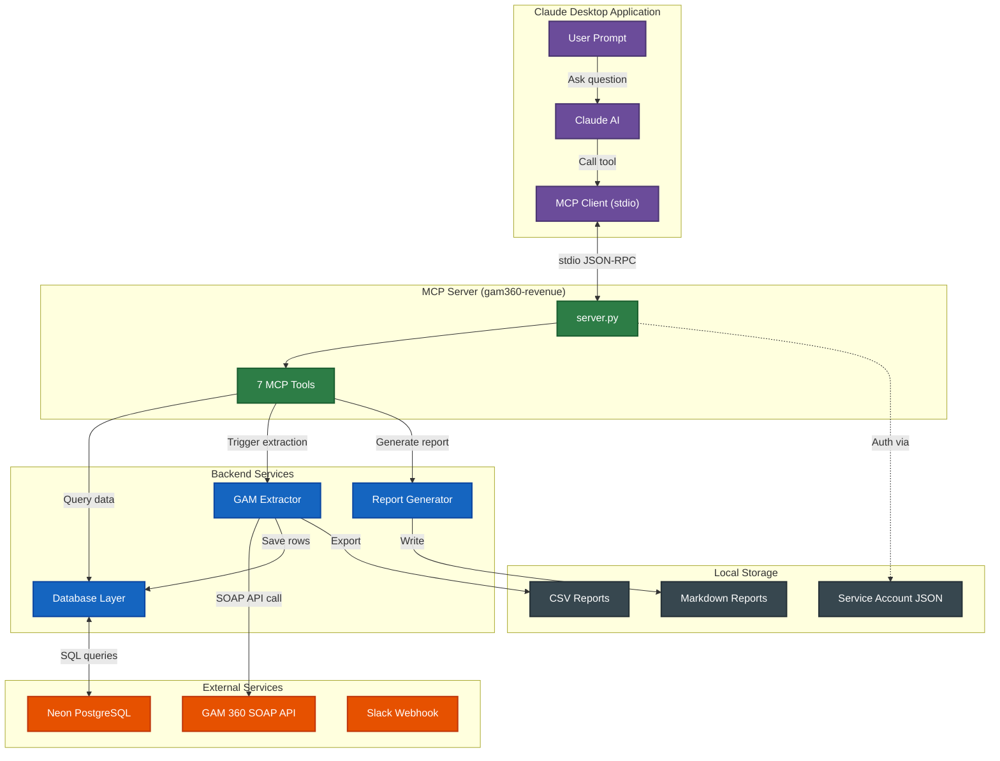
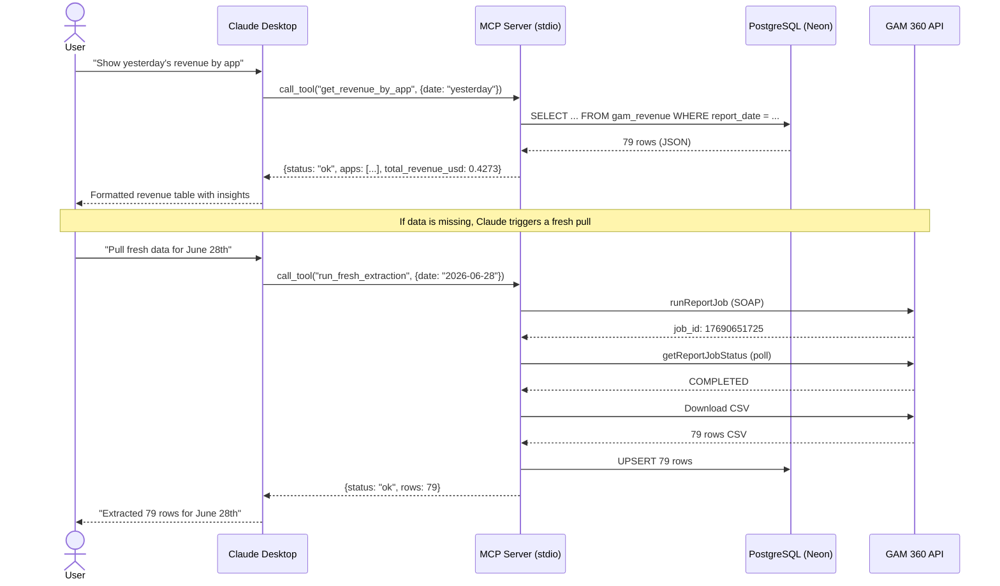
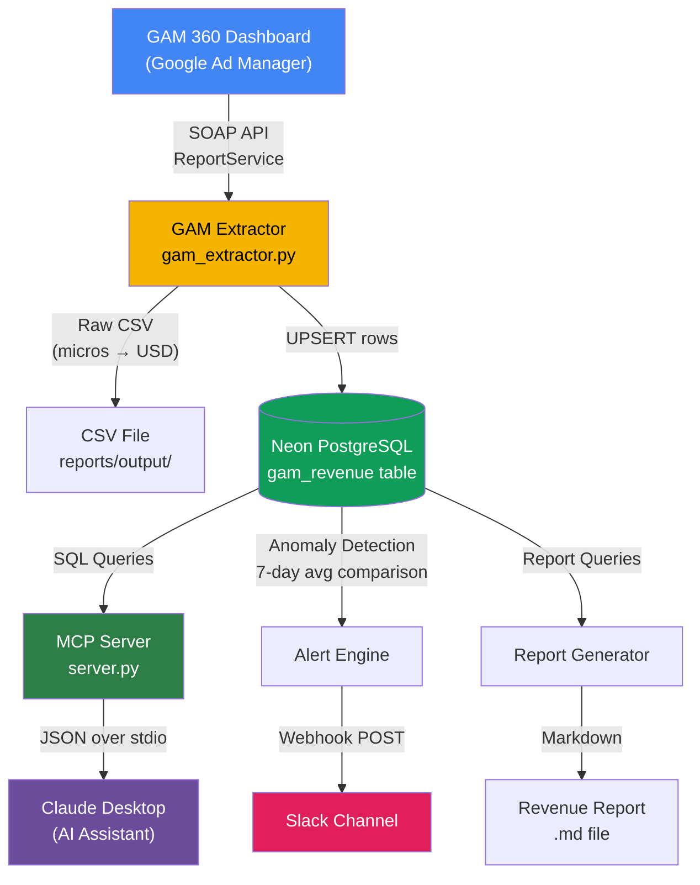
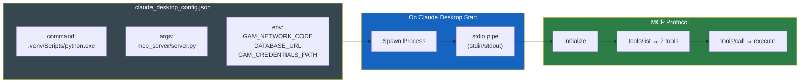
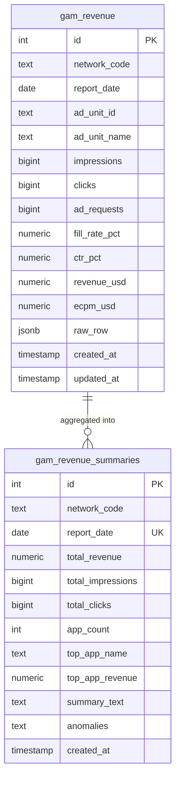

# GAM 360 Revenue Pipeline — MCP Architecture

## High-Level Architecture



---

## MCP Communication Flow



---

## MCP Server — Tool Reference

```mermaid
graph LR
    subgraph MCP_Tools["gam360-revenue MCP Tools"]
        T1["get_revenue_by_app"]
        T2["get_revenue_trend"]
        T3["get_network_total"]
        T4["detect_anomalies"]
        T5["run_fresh_extraction"]
        T6["save_daily_summary"]
        T7["generate_report"]
    end

    subgraph Categories[""]
        Read["📊 Read Data"]
        Write["💾 Write Data"]
        Extract["🔄 Live API"]
    end

    T1 --> Read
    T2 --> Read
    T3 --> Read
    T4 --> Read
    T5 --> Extract
    T6 --> Write
    T7 --> Write

    style Read fill:#1B5E20,color:white
    style Write fill:#E65100,color:white
    style Extract fill:#1565C0,color:white
```

| Tool | Purpose | Input | Output |
|------|---------|-------|--------|
| `get_revenue_by_app` | Revenue per app for a date | `date`, `limit` | App list with revenue, impressions, eCPM |
| `get_revenue_trend` | Daily trend for one app | `app_name`, `days` | Time series of revenue data |
| `get_network_total` | Network-level daily summary | `date` | Total revenue, impressions, top app |
| `detect_anomalies` | Find revenue drops vs 7-day avg | `date`, `threshold_pct` | Apps with significant drops |
| `run_fresh_extraction` | Pull live data from GAM API | `date` | Row count extracted |
| `save_daily_summary` | Save AI summary to DB | `date`, `summary_text` | Confirmation |
| `generate_report` | Create markdown report file | `date`, `include_trends` | Report file path |

---

## Data Flow Through the System



---

## File Structure & Responsibilities

```
gam360-pipeline/
├── config/
│   ├── .env                          # Environment variables (DB URL, network code)
│   ├── googleads.yaml                # GAM API auth config
│   ├── service_account.json          # GCP service account key
│   └── claude_desktop_config.json    # MCP server config for Claude Desktop
│
├── mcp_server/
│   └── server.py                     # MCP server — 7 tools exposed to Claude
│
├── extractor/
│   └── gam_extractor.py              # GAM 360 SOAP API data puller
│
├── database/
│   ├── db.py                         # DB layer (PostgreSQL + SQLite)
│   └── gam_revenue.db                # SQLite fallback (local dev)
│
├── reports/
│   └── output/                       # Generated CSV + Markdown reports
│
├── run_pipeline.py                   # Daily automation script (cron)
└── requirements.txt                  # Python dependencies
```

---

## How Claude Desktop Connects



---

## Database Schema



> **Unique constraint**: `(network_code, report_date, ad_unit_id)` — ensures one row per app per day per network, with UPSERT on re-extraction.
