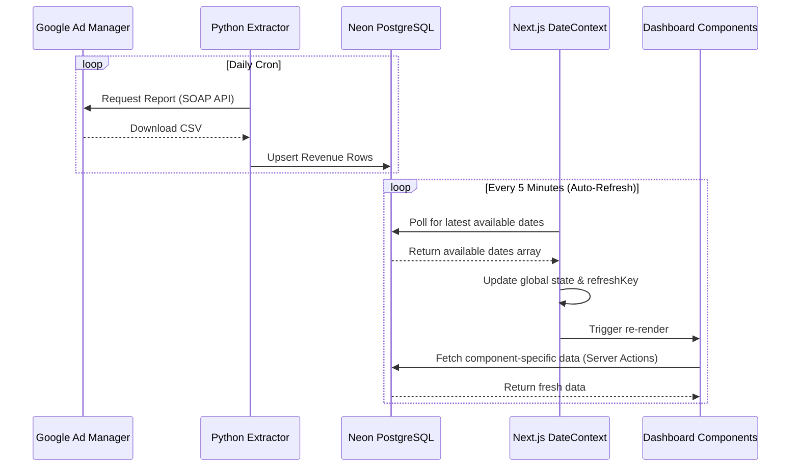
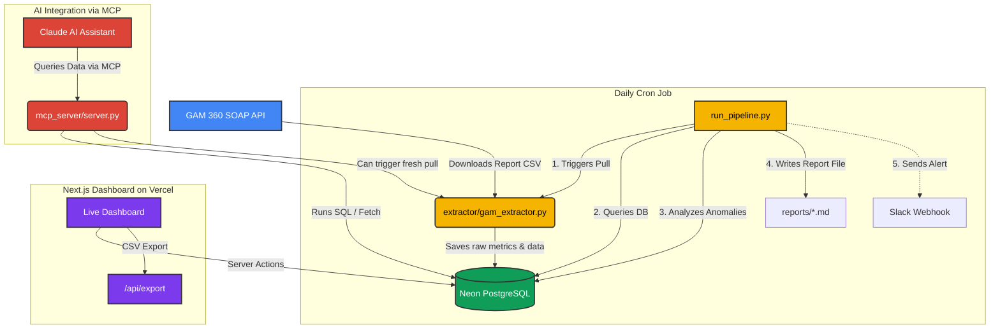

# GAM 360 Revenue Pipeline — SOAP API + MCP + Live Dashboard

**🚀 Live Dashboard:** [https://dashboard-nslvhdnom-aryan07175s-projects.vercel.app](https://dashboard-nslvhdnom-aryan07175s-projects.vercel.app)

Full pipeline to extract revenue data from Google Ad Manager 360
using the SOAP API, store it in a Neon PostgreSQL database, visualize it
through a real-time Next.js dashboard, and expose it via MCP
for Claude-powered summarization and reporting.

---

## 🏛️ System Architecture & Data Flow

This project is a complete end-to-end analytics pipeline that pulls raw data from Google Ad Manager 360, stores it efficiently, and surfaces it in a real-time dashboard. 

Here is exactly how the data moves through the system and updates the UI:

### 1. Data Extraction (GAM API → PostgreSQL)
* **The Extractor:** A Python script (`extractor/gam_extractor.py`) connects to the **Google Ad Manager 360 SOAP API**. It builds a specific `ReportQuery` to fetch daily revenue, impressions, and eCPM on a per-app (Ad Unit) basis.
* **The Database:** The extracted CSV reports are parsed and immediately upserted into a **Neon serverless PostgreSQL** database. The script ensures no duplicates exist using composite unique keys (`network_code`, `report_date`, `ad_unit_id`).
* **Automation:** A cron job runs this script automatically every day to keep the database synced with GAM's latest finalized numbers.

### 2. Dashboard State Management (React Context)
* **Global Context:** The Next.js dashboard uses a global `DateContext` (React Context API) to manage the state of the entire application from a single source of truth.
* **Auto-Discovery:** When the dashboard loads, it pings the database via Next.js Server Actions to discover **all available dates** that actually contain data. It does not blindly guess dates—if the GAM extractor hasn't pulled data for a day, the dashboard knows about it.
* **Reactivity:** Every chart, table, and metric on every page subscribes to this `DateContext`. When the selected date changes, the context updates, and **all components instantly re-fetch their specific data** and re-render simultaneously.

### 3. Live Updates & Auto-Refresh
* **Polling:** The `DateContext` runs a silent background timer (`setInterval`) that polls the database every **5 minutes**.
* **Seamless Refresh:** If the cron job pushes new GAM data into PostgreSQL while you have the dashboard open, the auto-refresh mechanism detects it. It bumps a `refreshKey` state variable, which instantly triggers all active charts and tables to seamlessly pull the fresh data without requiring a full page reload.



---

## 🌐 Dashboard Features

The dashboard is built to mimic and enhance the GAM 360 experience:

### Core Pages
* **Overview:** Network-wide KPIs (Total Revenue, Impressions, Clicks, eCPM, Fill Rate, Ad Requests) and 30-day trend charts.
* **Applications:** Per-app performance table with sortable columns and search functionality.
* **Revenue Analytics:** Revenue & eCPM trend charts with a top earning applications breakdown.
* **Anomaly Detection:** AI-driven anomaly detection comparing each app's daily revenue against its rolling 7-day average. Flags sudden drops > 20% with severity levels.
* **System Alerts:** Live alert feed flagging low impressions, low revenue, and poor fill rates across all ad units.
* **Reports:** Advanced report generator with configurable date presets (Yesterday, Last 7 Days, This Month, Custom Range). Tracks generation status and provides direct CSV downloads.

### Interactive UI
* **Database-Aware Date Picker:** The header calendar strictly limits selection to dates that actually exist in the database. The left/right arrows smartly skip over days with no data.
* **Dark Mode:** Full support for system-preference or manual light/dark themes.
* **Instant Export:** One-click CSV export of the current day's revenue data.

---

## 🏗️ Tech Stack

### Frontend — Dashboard (`/dashboard`)

| Technology | Purpose |
|-----------|---------|
| **Next.js 16** (App Router) | React framework with server actions, file-based routing |
| **TypeScript** | End-to-end type safety |
| **Tailwind CSS** | Utility-first styling |
| **shadcn/ui** | Accessible, composable UI components (Cards, Tables, Buttons, Selects, Badges) |
| **Recharts** | Interactive trend charts |
| **Lucide React** | Icon library |
| **date-fns** | Date manipulation and formatting |
| **next-themes** | Dark/Light mode toggle |
| **Vercel** | Production hosting with automatic deploys from GitHub |

### Backend — Data Pipeline (`/extractor`, `/database`, `/mcp_server`)

| Technology | Purpose |
|-----------|---------|
| **Python 3.12** | Pipeline orchestration and data extraction |
| **Google Ads API (SOAP)** | Pulls revenue reports from GAM 360 |
| **Neon PostgreSQL** | Cloud-hosted database storing all revenue data |
| **postgres (npm)** | Node.js PostgreSQL driver used by Next.js server actions |
| **MCP Server** | Model Context Protocol server for Claude AI integration |

### Infrastructure

| Service | Role |
|---------|------|
| **GitHub** | Source control — [Aryan07175/gam360api](https://github.com/Aryan07175/gam360api) |
| **Vercel** | Dashboard deployment with auto-deploy on push to `main` |
| **Neon** | Serverless PostgreSQL database |

---

## Architecture



---

## Quick Start

### 1. Install dependencies
```bash
pip install -r requirements.txt
```

### 2. Configure credentials
```bash
cp config/googleads.yaml.example config/googleads.yaml
# Fill in: network_code, path_to_private_key_file, application_name
```

### 3. Set up the database
```bash
python database/db.py --init
```

### 4. Run the extractor (pulls yesterday's revenue by app)
```bash
python extractor/gam_extractor.py --date yesterday
```

### 5. Start the MCP server
```bash
python mcp_server/server.py
```

### 6. Run the dashboard locally
```bash
cd dashboard
npm install
npm run dev
# Opens at http://localhost:3000
```

---

## Matching GAM 360 Dashboard

The SOAP API report uses the exact same dimensions/metrics as the GAM UI:

| GAM Dashboard column   | SOAP API Column                        |
|------------------------|----------------------------------------|
| Total revenue          | AD_SERVER_CPM_AND_CPC_REVENUE          |
| Impressions            | AD_SERVER_IMPRESSIONS                  |
| Clicks                 | AD_SERVER_CLICKS                       |
| eCPM                   | AD_SERVER_WITHOUT_CPD_AVERAGE_ECPM     |
| Fill rate              | AD_SERVER_FILL_RATE                    |
| Ad requests            | AD_SERVER_AD_REQUESTS                  |

| GAM Dashboard dimension | SOAP API Dimension                     |
|-------------------------|----------------------------------------|
| App name (ad unit)      | AD_UNIT_NAME                           |
| Date                    | DATE                                   |
| Order                   | ORDER_NAME                             |
| Line item               | LINE_ITEM_NAME                         |
| Ad type                 | AD_REQUEST_AD_TYPE                     |
| Country                 | COUNTRY_NAME                           |

## Per-app revenue

GAM 360 organises apps as **Ad Units** in the inventory hierarchy.
Each mobile app has a top-level ad unit (e.g. "com.yourco.appname").
The extractor uses `AD_UNIT_NAME` + `AD_UNIT_ID` dimensions and
filters by parent ad unit to isolate each app.

---

## 📂 Project Structure

```
gam360-pipeline/
├── config/                  # GAM API credentials
├── database/                # Database schema & connection (db.py)
├── extractor/               # GAM SOAP API extractor (gam_extractor.py)
├── mcp_server/              # MCP server for Claude AI integration
├── reports/                 # Generated markdown reports
├── run_pipeline.py          # Daily pipeline orchestrator
├── dashboard/               # Next.js analytics dashboard
│   ├── src/
│   │   ├── app/             # App Router pages
│   │   │   ├── (dashboard)/ # Dashboard pages (Overview, Apps, Revenue, etc.)
│   │   │   └── api/         # API routes (CSV export)
│   │   ├── components/      # UI components (header, sidebar, charts, cards)
│   │   ├── contexts/        # React contexts (DateContext for shared state)
│   │   ├── services/        # Server actions (PostgreSQL queries)
│   │   └── types/           # TypeScript type definitions
│   └── package.json
└── README.md
```

---

## License

MIT
